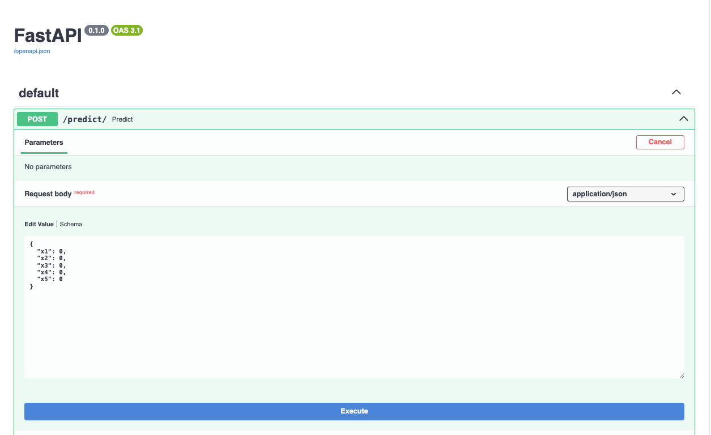

# 🏦 Loan Approval Prediction System 🚀

Welcome to the **Loan Approval Prediction System** — an end-to-end machine learning project that predicts whether a loan application will be approved or rejected based on applicant information.

This project leverages **Python, Scikit-learn, Pandas, Seaborn, Matplotlib, and FastAPI** to provide a seamless workflow from data analysis to model deployment.

---

## 📚 Project Overview

The goal of this project is to automate the loan approval decision-making process using machine learning.
The project covers the entire lifecycle:

- Data Cleaning & Preprocessing
- Exploratory Data Analysis (EDA)
- Model Training and Evaluation
- Hyperparameter Optimization
- Model Serialization
- Deployment via FastAPI

The trained model can be accessed through a **REST API endpoint (`/predict/`)** that accepts applicant data and returns an approval prediction.

---

## 🧩 Technologies Used

- **Python 3.9+**
- **FastAPI** – for API development
- **Scikit-learn** – for machine learning models
- **Pandas** & **NumPy** – for data manipulation
- **Matplotlib** & **Seaborn** – for data visualization
- **Joblib** – for model persistence
- **Jupyter Notebook** – for experimentation and visualization

---

## 📂 Project Structure

```
Loan Approval Prediction System/
│
├── Loan Data.csv                               # Dataset
├── Loan Approval Prediction System.ipynb        # Jupyter notebook with EDA & ML model
├── app.py                                       # FastAPI backend application
├── model.pkl                                    # Trained ML model (Support Vector Classifier)
├── Scaler.pkl                                   # StandardScaler for data normalization
├── image.png                                    # Swagger UI Screenshot
├── Loan Approval Prediction System.pdf          # Project report
└── README.md                                    # Project documentation
```

---

## 🧠 Machine Learning Pipeline

### 1️⃣ Data Cleaning
- Handled missing values using `dropna()`
- Removed duplicates and irrelevant records

### 2️⃣ Exploratory Data Analysis (EDA)
Visualizations created using **Seaborn** and **Matplotlib**:
- Loan status distribution
- Loan amount by education level
- Loan amount by property area
- Loan approval by gender and marital status
- Correlation heatmap

### 3️⃣ Feature Engineering
Selected key features for modeling:
`['Married', 'ApplicantIncome', 'Education', 'LoanAmount', 'Credit_History']`

- Label encoding applied to categorical variables.
- Standardization using **StandardScaler**.

### 4️⃣ Model Training
Trained and compared multiple classifiers:
- **Logistic Regression** → Accuracy: **84.94%**
- **K-Nearest Neighbors (KNN)** → Accuracy: **73.11%**
- **Support Vector Machine (SVM)** → Accuracy: **84.94%** *(final model)*

Best model and scaler were serialized using `joblib.dump()`:
```python
joblib.dump(gridsvm, 'model.pkl')
joblib.dump(scaler, 'Scaler.pkl')
```

---

## ⚙️ API Deployment (FastAPI)

### **Endpoint**
`POST /predict/`

---

### **Request Body (JSON)**
```json
{
  "x1": 0,
  "x2": 0,
  "x3": 0,
  "x4": 0,
  "x5": 0
}
```

---

### **Feature Mapping**
These values represent the scaled numerical inputs for:
- `x1`: Married
- `x2`: ApplicantIncome
- `x3`: Education
- `x4`: LoanAmount
- `x5`: Credit_History

---

### **Response Example**
Returns a JSON prediction:
```json
{
  "prediction": "Approved"   // or "Rejected"
}
```

---

### **Run the FastAPI App**
```bash
uvicorn app:app --reload
```

Then open your browser and go to:
👉 **http://127.0.0.1:8000/docs**
to access the Swagger UI.

---

## 📈 Model Performance Summary

| Model | Algorithm | Accuracy |
|--------|------------|-----------|
| Logistic Regression | Supervised Learning | 84.94% |
| KNN | Instance-based Learning | 73.11% |
| SVM | Kernel-based Learning | **84.94%** *(Selected Model)* |

---

## 💾 Saved Artifacts
- **model.pkl** – Trained Support Vector Machine model
- **Scaler.pkl** – Preprocessing scaler used for normalization

---

## 🌐 API Visualization
Swagger UI for `/predict` endpoint:


---

## 🚀 Future Enhancements

- Integrate a database (PostgreSQL / MongoDB) for storing user data.
- Add authentication to the API.
- Deploy on cloud platforms (AWS / Render / Heroku).
- Create a web-based dashboard using **Streamlit** or **React**.
